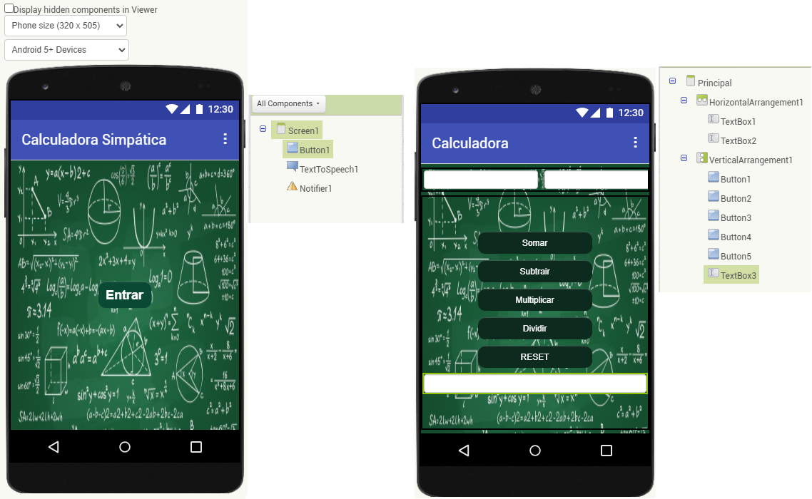

# Aula01
## Desenvolvimento Web
- No code ou Low Code
    - Mit App inventor
- Code
    - Flutter
    - React Native

## Conhecimentos
- 1 Dispositivos móveis 
  - 1.1 Definição 
  - 1.2 Histórico 
  - 1.3 Características 
  - 1.4 Arquitetura  
  - 1.5 Ambiente de desenvolvimento 
    - 1.5.1 Instalação e configuração 
    - 1.5.2 Gerenciamento de dependências 
    - 1.5.3 Recursos e interfaces

## Ambiente de desenvolvimento
- NoCode - Instalar o emulador aiStarter
- Code - Instalar o ambiente Flutter

## No code - App Inventor

### Demonstração 1
Aplicativo Calculadora Simples
- Layout
- Blocos - Ações dos botões e telas
- Botões
- Troca de telas
- Texto para Fala

Lógica de probramação em blocos

## Tipos de Build
- Arquivo .aia (Projeto) exportar o arquivo neste formato para enviar para o professor via github
- Arquivo .apk (Aplicativo) Versão para instalar no celular do desenvolvedor
- Connection QR Code (Aplicativo) Versão para instalar no celular do desenvolvedor. Utiliza o QR Code para conectar com o App Inventor

### Exemplo de Quiz

## Desafio
Em grupos com até 3 componentes, crie um quiz com pelo menos 10 questões, várias escolhas, sobre um dos temas a seguir:
- Temas
    - História
    - Inglês
    - Geografia
    - Biologia
    - Química
    - Física
    - Espanhol
Acrescente imagens, texto para fala, seja criativo.
