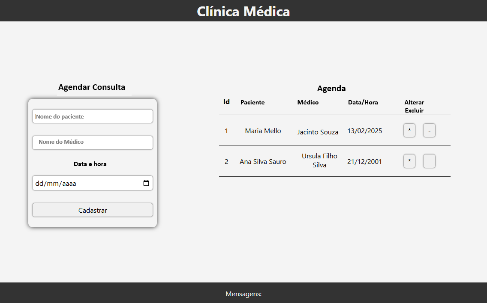

# Aula 02 - Projeto Full-Stack (CRUD) [MEET](https://meet.google.com/riu-akms-kqu)

#### Conhecimentos:
- Revisão de Back-end
    - Node.js
    - Express
    - Cors
    - MySQL
    - API REST / JSON
    - Endpoints
    - API - Criação de API (Plataforma de Interface de Aplicação)
    - CRUD - Funcionalidades de Cadastro, consulta
    - MVC - Padrão de projeto (Modelo, Visão e Controle)
    - Testes - Testes unitários da API utilizando software Insomnia

## Desafio
### Contexto:
- Foi solicitado que você realize o desenvolvimento de um projeto onde o objetivo principal é um Sistema para Gerenciamento de Agendamento de Clientes em uma Clínica Médica.
- Utilizando VsCode + Node.js, desenvolva junto com o professor a API e o Front-End.
- Inicialmente utilizaremos os verbos POST e GET para criarmos os cadastros de Consultas.

#### Script para o banco de dados
```sql
CREATE DATABASE clinica;
USE clinica;

CREATE TABLE consultas(
    consulta_id INTEGER PRIMARY KEY AUTO_INCREMENT,
    nome_paciente VARCHAR(255) NOT NULL,
    nome_medico VARCHAR(255) NOT NULL,
    data_hora DATE NOT NULL
);
```
|Wireframe|
|-|
||

## Demonstração e Testes
- Vamos desenvolver este projeto utilizando o padrão MVC tanto no Back-End quanto no Front-End 
- Ao concluir realizaremos testes para encontrar erros corrigí-los.
- Em seguida com os conhecimentos adquiridos vamos treinar com alguns desafios.

## Desafios
Este projeto se iniciou com um banco de dados básico. Em outra aula incrementaremos mais funcionalidades e melhorias.<br>Para a aula de hoje, em grupos de até 3 alunos, desenvolva projetos com funcionalidades similares escolhendo um dos temas a seguir:

### Tema1: Agenda de telefones
```sql
CREATE DATABASE agenda;
USE agenda;

CREATE TABLE telefones(
    telefone_id INTEGER PRIMARY KEY AUTO_INCREMENT,
    telefone VARCHAR(20) NOT NULL,
    nome VARCHAR(100) NOT NULL,
    obs VARCHAR(255) 
);
```
### Tema 02: Sistema de Gerenciamento de Produtos
```sql
CREATE DATABASE produtos;
USE produtos;

CREATE TABLE produtos(
    produto_id INTEGER PRIMARY KEY AUTO_INCREMENT,
    nome VARCHAR(255) NOT NULL,
    valor decimal(10,2) NOT NULL,
    descricao VARCHAR(255) NOT NULL
);
```

### Tema 03: Sistema de Controle de Gastos
```sql
CREATE DATABASE gastos;
USE gastos;

CREATE TABLE gastos(
    gasto_id INTEGER PRIMARY KEY AUTO_INCREMENT,
    data DATE NOT NULL,
    valor decimal(10,2) NOT NULL,
    descricao VARCHAR(255) NOT NULL
);
```

### Tema 04: Registro de Feedbacks
```sql
CREATE DATABASE feedbacks;
USE feedbacks;

CREATE TABLE feedbacks(
    feedback_id INTEGER PRIMARY KEY AUTO_INCREMENT,
    data DATE NOT NULL,
    nome VARCHAR(100) NOT NULL,
    email VARCHAR(100) NOT NULL,
    feedback VARCHAR(255) NOT NULL
);
```

### Tema 05: Sistema de Gerenciamento de Tarefas
```sql
CREATE DATABASE tarefas;
USE tarefas;

CREATE TABLE tarefas(
    tarefa_id INTEGER PRIMARY KEY AUTO_INCREMENT,
    data DATE NOT NULL,
    tarefa VARCHAR(255) NOT NULL,
    progresso BOOLEAN NOT NULL
);
```

### Outro tema de acordo com sua criatividade, desde que seja um CRUD com apenas uma tabela no banco de dados.
O projeto será apresentado a turma na próxima segunda feira. com a possibilidade de ser apresentado também a turma A ou B do segundo ano.

## Instruções para entrega
- 1 Em um repositorio do github chamado **back-end-aula02** envie o seu projeto full-stack com as três pastas:
    - api
    - docs
    - web
- 2 Crie um arquivo README.md com a descrição do projeto, uma lista das tecnologias e um passo a passo de como testar.
- 3 Envie o link do repositório no seguinte **[FORMS](https://docs.google.com/forms/d/e/1FAIpQLSf8WHx5YrWwMxJsGicTDuGmDtv-XR1pJiNqOw15rauXZSJLEw/viewform?usp=header)**
- **[Exemplo de projeto full-stack](https://github.com/wellifabio/back-end-aula02-2025.git)**
