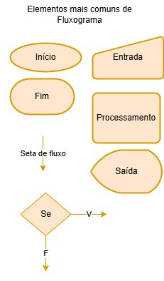
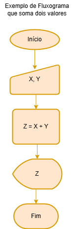
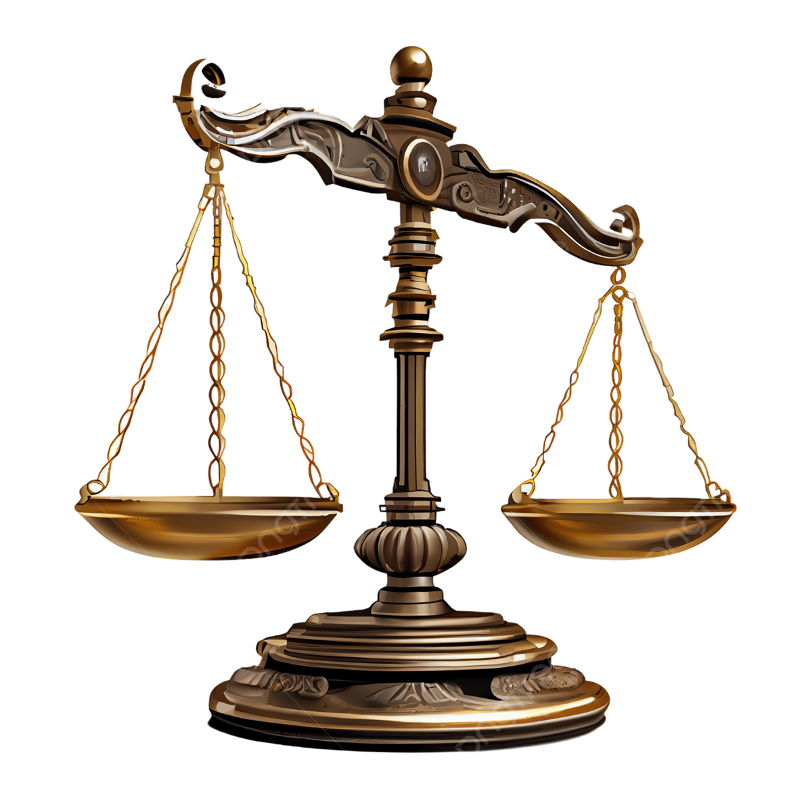

# Aula01 - Introcução à Lógica de Programação
- Algortimos
- Fluxogramas
- Variáveis e Constantes
- Resolução de Problemas
    - Trocar uma lâmpada
    - Desafio das Perolas

## Instruções
São como pequenas ordens, também chamadas de proposições:
- Ex:
```
Leia X;
Leia Y;
Z = X + Y;
Escreva Z;
```
Dispositivos digitais programáveis entendem **instruções**, um conjunto de instruções é chamado de **algoritmo**.

## Ciclo de funcionamento de um processador.
|Entrada|->|Processamento|->|Saída|
|-|-|-|-|-|

# Algoritmos
-  A receita para resolver problemas
- Um algoritmo é como uma receita de bolo: uma sequência de passos bem definidos que, quando seguidos corretamente, levam a um resultado específico. No caso dos algoritmos, o resultado é a solução para um problema ou a realização de uma tarefa.
- Em termos mais técnicos, um algoritmo é um conjunto finito de **instruções** que, quando executadas em uma ordem específica, resolve um problema computacional.
```
01 Leia X;
02 Leia Y;
03 Z = X + Y;
04 Escreva Z;
```
- No exemplo a cima temos quatro instruções duas de **entrada** uma de **processamento** e uma de **saída**.
- Caso as entradas forem 10 e 20 por exemplo, Z será 10 + 20, portanto a saída será 30.

# Fluxogramas
Um fluxograma é uma representação **gráfica** de um algoritmo ou processo. Ele utiliza **símbolos** / **elementos** padronizados para mostrar a sequência de passos, decisões e ações envolvidas em uma tarefa. Essa visualização facilita a compreensão, análise e comunicação de processos complexos.

- O mesmo exemplo de algoritmo representado em fluxograma
- 

### Por que algoritmos e fluxogramas são importantes?
- **Estruturam a resolução de problemas**: Ao decompor um problema em passos menores e mais gerenciáveis, os algoritmos facilitam a sua solução.
- **São a base da programação**: Toda programação, desde os programas mais simples aos mais complexos, é baseada em algoritmos.
- **Otimizam processos**: Existem diferentes algoritmos para resolver o mesmo problema, e a escolha do algoritmo mais eficiente pode fazer toda a diferença, especialmente em grandes conjuntos de dados.
### Exemplos de algoritmos no dia a dia:
- **Receita de bolo**: Cada passo da receita é uma instrução do algoritmo que leva ao resultado final: o bolo pronto.
- **Instruções de montagem de um móvel**: As instruções passo a passo garantem que o móvel seja montado corretamente.
- **Rotas de aplicativos de GPS**: O aplicativo calcula a melhor rota com base em algoritmos que analisam o tráfego, a distância e outros fatores.
- **Sistemas de recomendação**: As sugestões de filmes, músicas ou produtos em plataformas digitais são feitas por algoritmos que analisam seus dados e preferências.
### Tipos de algoritmos:
Existem diversos tipos de algoritmos, cada um com suas características e aplicações. Alguns dos mais comuns são:

- **Algoritmos de busca**: Utilizados para encontrar um elemento específico dentro de um conjunto de dados.
- **Algoritmos de ordenação**: Organizam os dados em uma ordem específica, como crescente ou decrescente.
- **Algoritmos de grafos**: Trabalham com estruturas de dados chamadas grafos, que representam relações entre diferentes objetos.
- **Algoritmos de aprendizado de máquina**: Utilizados para fazer previsões e tomar decisões com base em dados.

## Variáveis
São espaços de memória, que servem para armazenar valores, podem ou não possuir tipos como, números inteiros, números decimais, textos, caracteres, datas e outros.

## Constantes
São valores fixos, exemplo **Pi** que sempre vale **3.14**

## Exemplo de variávis e constantes
- Outro exemplo seria quando calculamos a média aritimética de três valores: **(x + y + z) / 3**
- Os ítens **x, y e z** são **variávies** que serão somadas e sempre serão divididas pela constante **3**.

## Resolução de problemas
Algoritmos e fluxogramas são algumas das ferramentas utilizadas para resolução de problemas computacionais.
Um algoritmo básico que podemos utilizar para resolução de problemas é:

- 0 Definir se é um problema ou não.
    - O que é um problema? Algo que tenha solução e esta não seja trivial.
        - Se não tem solução não é um problema
        - Se a solução é trivial não é um problema
- 1 Desompor
    - Dividir o problema em problemas menores
    - Resolver os problemas menores
- 2 Encontrar padrões
    - Ao resolver os problemas menores, procurar padrões que fecilitem a resolução de outros problemas menores.
- 3 Escrever um algoritmo ou um programa de computador utilizando os padrões encontrados.

## Desafio da troca de lâmpada.
Ao escrever um algoritmo para a troca de uma lâmpada devemos pensar que qualquer pessoa que leia consiga executar a terefa de trocar a lâmpada. Até mesmo um robô.

## Desafio das pérolas
Um joalheiro possui 9 perolas negras, sendo 8 verdadeiras e uma falsa (mais leve), todas são exatamente iguais exceto pelo peso.
Utilizando uma balança semelhanta a da imagem abaixo apenas duas vezes ele deve encontrar a pérola falsa. Escreva um algoritmo que descreva os passos que devemos seguir para a solução.


## Exercícios
- 1 Crie um fluxograma que receba como entrada a três números inteiros, calcule a média aritimética destes números e mostre o resultado como saída.
- 2 Sabendo que a transpotadora ACME possui caminhões que transportam no máximo 5 toneladas por viagem, faça um fluxograma que receba o peso em toneladas a ser transportado, calcule e mostre quantos caminhões serão necessários.
- 3 Desenhe um fluxorama que receba como entrada data de nascimento de uma pessoa, calcule e mostre quantos anos ela possui.
