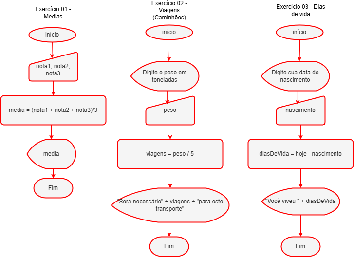

# Aula 02
## Trabalhando:
- Algortimos
- Fluxogramas

## Instruções
São como pequenas ordens, também chamadas de proposições:
- Ex:
```
Leia nota1;
Leia nota2;
Leia nota3;
I = (X + Y + Z)/3;
Escreva I;
```

## Ciclo de funcionamento de um processador.
|Entrada|->|Processamento|->|Saída|
|-|-|-|-|-|

## Exercícios
- 1 Crie um fluxograma que receba como entrada a três números inteiros, calcule a média aritimética destes números e mostre o resultado como saída.
- 2 Sabendo que a transpotadora ACME possui caminhões que transportam no máximo 5 toneladas por viagem, faça um fluxograma que receba o peso em toneladas a ser transportado, calcule e mostre quantos caminhões serão necessários.
- 3 Desenhe um fluxorama que receba como entrada data de nascimento de uma pessoa, calcule e mostre quantos anos ela possui.

### Correção


## Execução do fluxograma 02 em linguagem C
```c
#include <stdio.h>

int main() {
    int peso, viagens;
    printf("Digite o peso em toneladas: ");
    scanf("%d",&peso);
    viagens = peso / 5;
    printf("Serão necessárias %d viagens", viagens);
    return 0;
}
```
- Resultado:
```bash
Digite o peso em toneladas: 50
Serão necessárias 10 viagens
```

## Execução do fluxograma 02 em linguagem Python
```python
peso = int(input('Digite o peso em toneladas:'))
viagens = peso / 5
print('Será necessário ', viagens, ' viagens para este transporte')
```
- Resultado:
```bash
Digite o peso em toneladas: 50
Será necessário  10.0  viagens para este transporte
```
