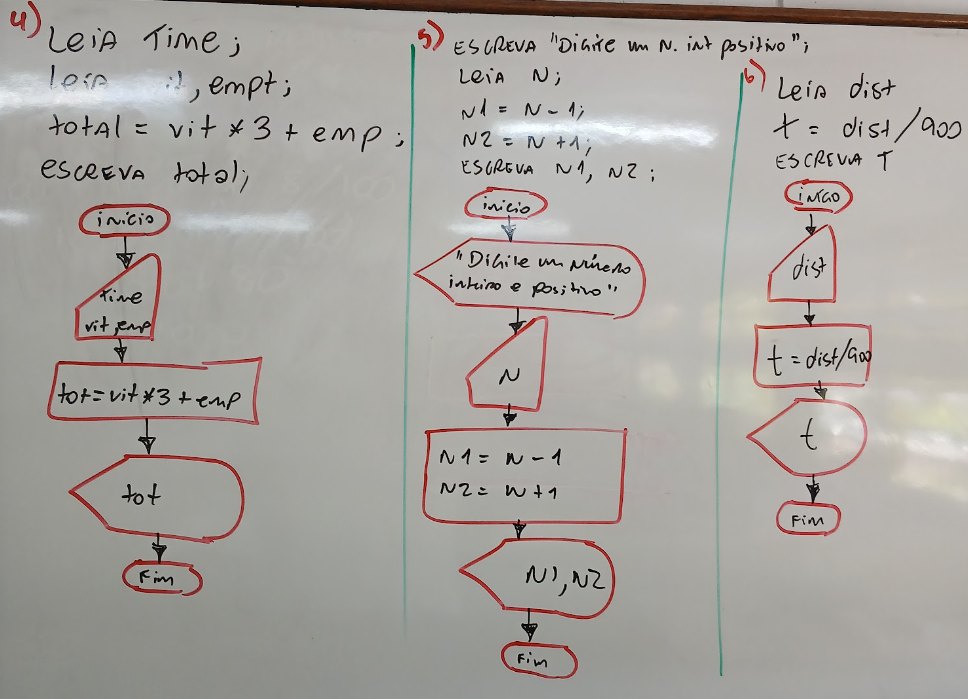
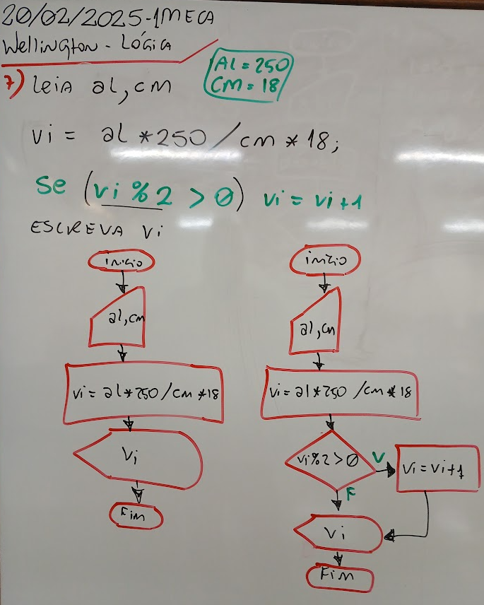

# Aula03 - Algoritmo, Fluxograma e Programação

## Lista de exercícios
- 1 - 1 Desenvolva um algoritmo e um fluxograma que leia três variáveis (a, b, c) e resolva a expressão: ( a + b ) / c.
- 2 Desenvolva um algoritmo e um fluxograma que leia a velocidade de um carro (km/h) e a distância a ser percorrida (km) por ele. Calcule e apresente na tela, quanto tempo (horas) será necessário para o carro percorrer a distância informada.
- 3 Desenvolva um algoritmo e um fluxograma que leia o nome e o salário de uma pessoa, depois leia o valor do índice percentual (%) de reajuste do salário. Calcule e apresente na tela, o valor do novo salário e o nome da pessoa.
- 4 Desenvolva um algoritmo e um fluxograma que leia o nome de um time de futebol, o número de vitórias e o número de empates. O algoritmo e um fluxograma deverá calcular e apresentar na tela, o nome do time e o total de pontos. Lembrando que a vitória vale 3 pontos e o empate vale 1 ponto.
- 5 Desenvolva um algoritmo e um fluxograma que leia um número ”n” inteiro, positivo e diferente de zero e apresente na tela: n – 1, e também n + 1.
- 6 Sabendo-se que a velocidade de cruzeiro de um avião 747-300 é de 900 km/h, faça um algoritmo e um fluxograma que leia uma distância (km), calcule e apresente na tela, quanto tempo (horas) será necessário para um 747-300 sobrevoar a distância informada.
- 7 Um caminhão consegue transportar 18 toneladas de laranjas em uma viagem que faz entre a fazenda e a fábrica de suco de laranja. Um alqueire de terra produz em média 250 toneladas de laranjas. Faça um algoritmo e um fluxograma que leia quantos caminhões e quantos alqueires uma fazenda produtora de laranjas possui, calcule e apresente na tela quantas viagens de caminhão serão necessárias para transportar toda a colheita de laranjas.
- 8 Desenvolva um algoritmo e um fluxograma que leia o raio (cm) e a altura (cm) de um cilindro. Calcule e mostre a área (cm2) e o volume (cm3) do cilindro.
- 9 Desenvolva um algoritmo e um fluxograma que leia o nome e o preço de uma mercadoria. O algoritmo e um fluxograma deverá calcular um aumento de 5% no preço da mercadoria e mostrar o nome da mercadoria e o seu novo preço.
- 10 Desenvolva um algoritmo e um fluxograma que leia o nome de uma cidade, o número total de eleitores e o número total de votos apurados na última eleição. O algoritmo e um fluxograma deverá calcular e exibir a porcentagem de participação dos eleitores desta cidade na última eleição.
- **Obs**: Todas as entradas serão consideradas como valores inteiros e positivos, portanto o algoritmo e um fluxograma não precisará testá-las.

### Todos os algoritmos e fluxogramas deverão ser feitos no seu caderno e mostrados ao professor na aula seguinte.
Os programas em python serão desenvolvidos no laboratório de informática na próxima aula.

## [Link para a entrega dos códigos fontes em Python](https://forms.gle/7xKikVNzboWx1RM46)

## Correções em aula
- Correção de alguns exercícios em aula, para que possam ser utilizados como referência para a resolução dos demais exercícios.
- 
- 