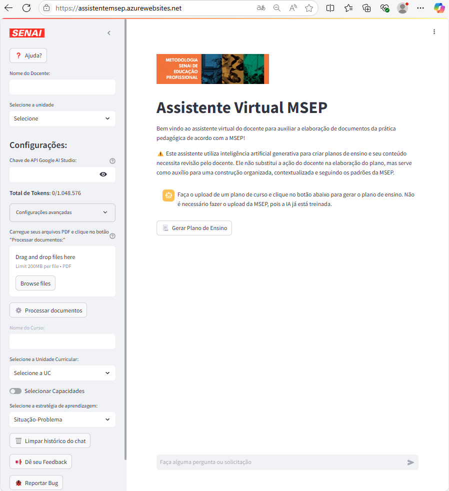

# Assistente Virtual MSEP
|[Link do Assistente](https://assistentemsep.azurewebsites.net/)|[Tutorial](./IA-Assistente-MSEP.pdf)|
|-|-|
|Interface Web que utiliza a API da IA Generativa **Gemini** treinada com a MSEP (Metodologia SENAI de Educação Profissional) com o intúito de agilizar o desenvolvimento de **Planos de Ensino**|Passo a Passo de como utilizar a IA (Inteligência Artificial)|

|Assistente - OBS|
|:-:|
|Por enquanto na versão de testes, é necessário utilizar um gmail pessoal para criar uma chave de API|
||

